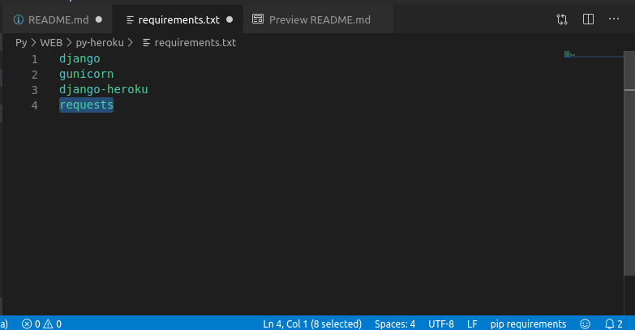

# Heroku-Python


<hr>

<h3>  :computer: Environment and knowledge required. </h3>

<p>Hello, you may wondering why this repository is existing ?</p>

<p>Well, he completing my setup for practice web python (in this case for python), on this repository I'm gonna guide you to deploy an Heroku application who running with Python,Django,Postgre.</p>

<p>If you just want to deploy a python web service with django as client and server, take a look on my other repository : <a href="https://github.com/R3tr093/Python-DockerCompose">Python Docker-compose</a> you need docker-compose to run it, is just a quick setup for practice Django in a container, you have to find how to use Django for carrying web service by yourself.</p>

<p>You can use this application locally to practice and deploy it on heroku when you're ready to do it. So let me tell you about the few things you have to understand to follow the repository.</p>

<h4> :notebook: <i>the following things are required : </i> </h4>

<p><b><a href="https://signup.heroku.com/">A free heroku account.</a></b></p>
<p><b><a href="https://devcenter.heroku.com/articles/heroku-cli" target="_blank">Heroku CLI</a></b></p>
<p><b><a href="https://gist.github.com/derhuerst/1b15ff4652a867391f03" target="_blank">Python 3.7 localy</a></b></p>
<p><b><a href="https://www.postgresql.org/docs/12/tutorial-install.html" target="_blank">Postgres localy</a></b></p>
<p><b><a href="https://help.github.com/en/desktop/getting-started-with-github-desktop/installing-github-desktop">Github localy</a></b></p>
<p><b>Basic knowledges of python  ( Not really necessary but it should help you ) </b></p>

<p>I write this by reading the <a href="https://devcenter.heroku.com/articles/getting-started-with-python" target="_blank">Heroku official documentation</a>, so if something seem don't work, take a look right there.</p>

<hr>

<h3> :open_file_folder: List of content </h3>

<ul>

<li><a href="#start">Prepare the app</a></li>
<li><a href="#deploy">Deploy the app</a></li>
<li><a href="#logs">View logs</a></li>
<li><a href="#scale">Scale the app</a></li>
<li><a href="#dependencies">Declare app dependencies</a></li>
<li><a href="#local">Run the App locally</a></li>
<li><a href="#push">Push local changes</a></li>
<li><a href="#addon">Provision add-ons</a></li>
<li><a href="#cons">Start a console</a></li>
<li><a href="#conf">Define config vars</a></li>
<li><a href="#db">Provisions a postgre Database</a></li>
</ul>

<hr>
<h3 id="start">:construction_worker: Prepare the app </h3>
<hr>

<p>Download the heroku getting started repository by typing the command below : </p>
<code>git clone https://github.com/heroku/python-getting-started.git </code><br><br>
<p>Then move into the directory you just downloaded : </p>
<code>cd python-getting-started</code><br><br>

<p>Feel free to explore the content of the directory, it may be helpful </p>


<hr>
<h3 id="deploy">:rocket: Deploy your application on heroku. </h3>
<hr>

<code> heroku create </code><br><br>
<code> git push heroku master && heroku open </code><br><br>

<p><em>A new tab / window should be opened into your browser when the command is done.</em></p>

<hr>
<h3 id="logs">:lock_with_ink_pen: View logs</h3>
<hr>


<code>heroku logs --tail</code><br><br>
<p><em><b>Then type ctrl + c if you want to quit the logs views.</b></em></p>

<hr>
<h3 id="scale"> :mag: Scale the app </h3>
<hr>


<p>Your app is running into a <b>dyno</b>, you can see dyno like a lightweight container, Free dynos will sleep after a half hour of inactivity (if they don’t receive any traffic). This causes a delay of a few seconds for the first request upon waking. </p>

<p>Also all of yours free dyno consume from a monthly quota of free dyno hours - as long as the quota is not exhausted, all free apps can continue to run.</p>

<p>checkout the status of dyno by the command below : </p>

<code> heroku ps </code><br><br>


<hr>
<h3 id="dependencies"> :clipboard: Declare app dependencies</h3>
<hr>

<p>In the root of the directory, you should find a file named as <b>requirements.txt</b> this file containt the dependencies you expect for your application</p>

<p>For now the requirements.txt mention : <b>django, gunicorn, django-heroku</b></p>

<p>The command below will install this dependencies in our application : </p>

<code>pip install -r requirements.txt</code><br><br>

<p>:warning: Note: Postgres must be properly installed in order for this step to work properly.</p>

<p>:warning: Note: if you’re running Linux, the <a href="https://zoomadmin.com/HowToInstall/UbuntuPackage/libpq-dev">libpq-dev system package</a> (or equivalent for your distribution) must also be installed.</p>

<hr>
<h3 id="local">:tada: Run the app locally</h3>
<hr>

<p>Django uses local assets, so first, you’ll need to run collectstatic:</p>

<code>python manage.py collectstatic</code><br><br>

<p>Then, run your application localy by the command below : </p>

<code>heroku local web</code><br><br>

<p><i>Open <a href="http://localhost:5000 " target="_blank">http://localhost:5000 </a> with your web browser. You should see your app running locally.</i></p>


<hr>
<h3 id="push"> :rocket: Push local changes</h3>
<hr>

<p>Let's add a new dependencies in the <b>requirements.txt</b> file : </p>


<p>Install request locally : </p>

<code>pip install requests</code><br><br>

<p>Now, Modify the gettingstarted/hello/views.py rewrite the function index : </p>

```python

def index(request):
    r = requests.get('http://httpbin.org/status/418')
    print(r.text)
    return HttpResponse('<pre>' + r.text + '</pre>')

```

<p>And import the requests module by typing this new line at the start : </p>

```python
import requests
```

<p>Take a look on our changes : </p>

<code>heroku local</code><br><br>

<p> You can deploy the changes by using theses command : </p>

<code>git add .</code><br><br>
<code>git commit -m "Demo"</code><br><br>
<code>git push heroku master</code><br><br>
<code>heroku open</code><br><br>


<hr>
<h3 id="addon">  :moneybag: Provision add-ons (it's free) </h3>
<hr>

<p>Provision the papertrail logging add-on: </p>

<code>heroku addons:create papertrail</code><br><br>

<p>Check addons report : </p>

<code>heroku addons:open papertrail </code><br><br>

<p><b>OR</b></p>

<code>heroku addons:open database</code><br><br>

<hr>
<h3 id="cons">  :computer: Start a console  </h3>
<hr>

<code>heroku run python manage.py shell</code><br><br>

<p><b>type ' exit ' to close the console.</b></p>

<hr>
<h3 id="conf">:cd: Define config vars</h3>
<hr>

<p>Edit <b>hello/views.py </b> At the beginning, add a line to import the os module:</p>

```python
import os
```

<p>Now modify the <b> index </b> method : </p>

```python
def index(request):
    times = int(os.environ.get('TIMES',3))
    return HttpResponse('Hello! ' * times)
```

<p>Take a look on your config by the command : </p>

<code>heroku config</code><br><br>

<p>You can see the changes in local with <b><i>heroku local</i></b></p>


<hr>
<h3 id="db"> :book: Run the database </h3>
<hr>

<p> Run the standard Django manage.py migrate to create the tables.</p>
<code>heroku run python manage.py migrate</code><br><br>

<p>Assuming that you have Postgres installed locally, use the heroku pg:psql command to connect to the remote database and see all the rows:</p>
<code>heroku pg:psql</code><br><br>

<p><a href="https://www.postgresql.org/docs/12/index.html" target="_blank">Postgresql official documentation</a></p>

<hr>
<h3 href="end"> :end: In conclusion</h3>
<hr>

<p>You have an environment to practice with Django to create web applications. This readme is only a condensed version so I can remember how to deploy this environment, you will find more information on other sources if you need it.</p>